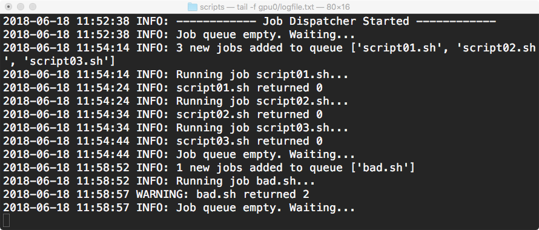

# Experiments
Tools to setup and manage machine learning tests and experiments on a remote machine.

Screenshot:

<div style="width: 890px; height: 380px;">
    
</div>

(Requires Python version 3.3 or higher)

## 1. Job Dispatcher

`jobdispatcher.py` is a simple Python script that allows you to automate 
the execution of shell scripts. The purpose of the tool is to execute 
scripts one after another from a queue. This is useful when you are 
working on a remote machine such as a GPU and want to run multiple 
experiments without too much supervision.

### Overview

First it creates a directory in the location it was launched from with 
the gpu number specified by the argumnet gpu, e.g. `gpu1`.

It then creates three subdirectories in that directory:
- `queue`
- `completed`
- `failed`

Then it waits for shell scripts (extension .sh) to appear in the queue
directory. It checks every second and when it sees one or more they are
added to a queue and each job is executed one after the other.

To start running jobs, simply move script files (i.e. `myscript.sh`) to 
the queue directory.

When it sees a script, it is first moved to the current directory 
(`scripts`) and then executed with Python's `subprocess.run` command.
When complete, it is moved to the `complete` directory.

Log output is written to `logfile.txt`.


### Example usage

#### 1. Get help text

In a terminal or shell session from within the `scripts` sub-directory, type:
```
$ python jobdispatcher.py --help
usage: Python script to automate the execution of shell scripts
       [-h] --gpu GPU [--dir DIR] [--wait WAIT]

optional arguments:
  -h, --help   show this help message and exit
  --gpu GPU    GPU id
  --dir DIR    Directory name for queues (optional)
  --wait WAIT  Wait time (seconds) between checks for new items in queue.
 ```


#### 2. Setup

 
 ```
 $ python jobdispatcher.py --gpu 0
 ```
 
 This creates a sub-directory called `gpu0`.
 
 ```
$ ls
examples		gpu0			jobdispatcher.py
```
 
 Then open another terminal session and from the scripts directory type the
 following command:
 
 ```
 $ tail -f gpu0/logfile.txt
2018-06-18 11:52:38 INFO: ------------ Job Dispatcher Started ------------
2018-06-18 11:52:38 INFO: Job queue empty. Waiting...
```

This means the jobdispatcher launched, set up the subdirectories and is
now waiting for shell scripts to appear in `gpu0/queue`.

Keep the log file session open so you can monitor what the job dispatcher is doing.


#### 3. Running scripts

Now, open a new session and move a shell script into the queue (in this demo
we copy the three 'dummy' scripts provided in the `examples` folder):

```
$ ls examples/*
examples/TEMPLATE.sh	examples/script01.sh	examples/script03.sh
examples/bad.sh		examples/script02.sh
$ cp examples/script*.sh .
$ chmod +x script*.sh
$ ls
examples		jobdispatcher.py	script02.sh
gpu0			script01.sh		script03.sh
$ mv script*.sh gpu0/queue
$ 
```

After moving the script you should see the following in the jobdispatcher
`logfile.txt` window:

```
$ tail -f gpu0/logfile.txt
2018-06-18 11:52:38 INFO: ------------ Job Dispatcher Started ------------
2018-06-18 11:52:38 INFO: Job queue empty. Waiting...
2018-06-18 11:54:14 INFO: 3 new jobs added to queue ['script01.sh', 'script02.sh', 'script03.sh']
2018-06-18 11:54:14 INFO: Running job script01.sh...
```

And after about 30 seconds more log messages should appear:

```
2018-06-18 11:54:24 INFO: script01.sh returned 0
2018-06-18 11:54:24 INFO: Running job script02.sh...
2018-06-18 11:54:34 INFO: script02.sh returned 0
2018-06-18 11:54:34 INFO: Running job script03.sh...
2018-06-18 11:54:44 INFO: script03.sh returned 0
2018-06-18 11:54:44 INFO: Job queue empty. Waiting...
```

`script01.sh returned 0` indicates that the shell script was executed and completed successfully.

You should then see the three scripts have been moved to the `completed` directory:

```
$ ls gpu0/completed
script01.sh	script02.sh	script03.sh
```

If there is a problem executing a script, you get a warning in the log and the script is moved
to the `failed` directory instead:

```
$ cp examples/bad.sh .
$ chmod +x bad.sh
$ mv bad.sh gpu0/queue
```

Output to `logfile.txt`:
```
2018-06-18 11:58:52 INFO: 1 new jobs added to queue ['bad.sh']
2018-06-18 11:58:52 INFO: Running job bad.sh...
2018-06-18 11:58:57 WARNING: bad.sh returned 2
2018-06-18 11:58:57 INFO: Job queue empty. Waiting...
```

```
$ ls gpu0/failed
bad.sh
```


 
 
