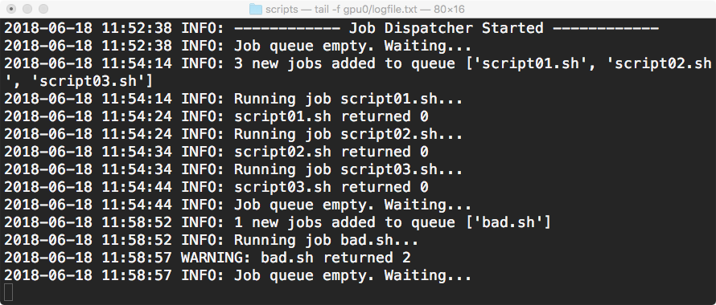

# Experiments
This repo contains tools to setup and manage large numbers of computational experiments in sequence on different 
GPUs (processing units).  There are three main sets of tools here:

1. [jobdispatcher.py](jobdispatcher.py) - tools to schedule and run multiple experiments on a remote machine
2. [utils.py](utils.py) - automated creation of shell scripts to launch experiments
3. [paramtests.py](paramtests.py) - function to generate random parameter values


## 1. Job dispatcher

Screenshot:

<div style="width: 890px; height: 380px;">
    
</div>

(Requires Python version 3.3 or higher)

[`jobdispatcher.py`](jobdispatcher.py) is a simple Python script that allows you to automate 
the execution of shell scripts. The purpose of the tool is to execute 
scripts one after another from a queue. This is useful when you are 
working on a remote machine such as a GPU and want to run multiple 
experiments with minimum supervision.

It uses the `CUDA_VISIBLE_DEVICES` environment variable so that each job 
dispatcher queue is dedicated to one GPU (as described [here](https://stackoverflow.com/questions/39649102/how-do-i-select-which-gpu-to-run-a-job-on)) allowing 
you to run scripts in parallel on more than one GPU.


### Overview

Put [`jobdispatcher.py`](jobdispatcher.py) in a new sub-directory on a server where you want
to execute the shell scripts.  Launch it and let it run in the background.

It creates a new directory in the parent directory from which it was
launched with a name like `'gpu0'` (the number is determined by the --gpu
argument).

It then creates three subdirectories in that directory:
- `queue`
- `completed`
- `failed`

Then it waits for shell scripts (extension `.sh`) to appear in the 'queue'
directory. It checks every second and when it sees one or more they are
added to a queue and each job is executed one after the other.

To start running jobs, copy script files (e.g. `my_script.sh`) to the
'queue' directory.

First jobdispatcher moves the script to the parent directory and then
executes it with subprocess.run.  When complete, it is moved to the
'complete' directory.

Log output is written to `logfile.txt`.


### Basic usage example

#### 1. Get help text

After downloading or cloning this repository to a directory on your local 
machine, open a terminal or shell session and from within the repository, 
type:

`$ python jobdispatcher.py -h`

This will display help information on the command-line arguments that `jobdispatcher.py` accepts:

```
usage: Python script to automate the execution of shell scripts on GPUs.
       [-h] --gpu GPU [--dir DIR] [--wait SEC]

optional arguments:
  -h, --help  show this help message and exit
  --gpu GPU   GPU id
  --dir DIR   Directory name for queues (default: '../')
  --wait SEC  Wait time (seconds) between checks for new items in queue.
 ```


#### 2. Setup

Set up your first job dispatcher process like this:
 
 ```
  $ python jobdispatcher.py --gpu 0
 ```
 
 This creates a sub-directory in the repository's parent directory called `gpu0`
 and starts the job dispatcher.
 
 Then open another terminal session and from the same directory type the
 following to check that it worked and see what it put inside `gpu0`:
 
```
 $ ls ../gpu0
completed	failed		logfile.txt	queue
```

It created three sub-directories plus a text file.

To monitor what it is doing you can use the following unix command to display
a live feed of the contents of `logfile.txt`:

```
 $ tail -f ../gpu0/logfile.txt
2019-05-25 17:48:01 INFO: ------------ Job Dispatcher Started ------------
2019-05-25 17:48:01 INFO: Job queue empty. Waiting...
```

This means the jobdispatcher launched, and is now waiting for shell scripts to 
appear in `gpu0/queue`.

Keep the log file session open so you can monitor what it is doing.


#### 3. Running scripts

Now, open a new session and move a shell script into the queue (in this demo
we copy the three 'dummy' scripts provided in the [`examples`](examples/) folder):

```
 $ ls examples/*
examples/TEMPLATE.sh	examples/script01.sh	examples/script03.sh
examples/bad.sh		examples/script02.sh
 $ cp examples/script*.sh .
 $ chmod +x script*.sh
 $ mv script*.sh ../gpu0/queue
```

After moving the script you should see the following in the jobdispatcher
`logfile.txt` window start to appear:

```
2019-05-25 17:48:01 INFO: ------------ Job Dispatcher Started ------------
2019-05-25 17:48:01 INFO: Job queue empty. Waiting...
2019-05-25 17:55:12 INFO: 3 new jobs added to queue ['script01.sh', 'script02.sh', 'script03.sh']
2019-05-25 17:55:12 INFO: Running job script01.sh...
2019-05-25 17:55:22 INFO: script01.sh returned 0
2019-05-25 17:55:22 INFO: Running job script02.sh...
2019-05-25 17:55:32 INFO: script02.sh returned 0
2019-05-25 17:55:32 INFO: Running job script03.sh...
2019-05-25 17:55:42 INFO: script03.sh returned 0
2019-05-25 17:55:42 INFO: Job queue empty. Waiting...
```

`script01.sh returned 0` indicates that the shell script was executed and 
completed successfully.

You should also find that the three scripts have been moved to the `completed` 
directory:

```
 $ ls ../gpu0/completed
script01.sh	script02.sh	script03.sh
```

If there is a problem executing a script, you will get a warning in the log 
and the script is moved to the 'failed' directory instead:

```
 $ cp examples/bad.sh .
 $ chmod +x bad.sh
 $ mv bad.sh ../gpu0/queue
```

Output to `logfile.txt`:
```
2019-05-25 17:58:13 INFO: 1 new jobs added to queue ['bad.sh']
2019-05-25 17:58:13 INFO: Running job bad.sh...
2019-05-25 17:58:18 WARNING: bad.sh returned 2
2019-05-25 17:58:18 INFO: Job queue empty. Waiting...
```

```
 $ ls ../gpu0/failed
bad.sh
```

One nice feature of job dispatcher is that you can remove scripts from the 
queue (before they are executed) without interrupting execution of the current 
job.  Job dispatcher executes any new scripts it finds in the queue after all 
previous jobs are complete.

New scripts added are executed in the alpha-numeric order of their filenames.

### Use for machine learning

For an example of how to design scripts for running a machine-learning experiment, 
see the `TEMPLATE.sh` script in the [`examples`](examples/) folder.


## 2. Automated creation of shell scripts

The module [`utils.py`](utils.py) contains a function `create_shell_script` that
be used to generate executable shell scripts with pre-defined parameters.

Here is a simple example in Python:

```
>>> from utils import create_shell_script
>>> params = {'model': 'LeNet', 'dataset': 'mnist'}
>>> headers = ["LOGDIR='../logs/mnist/'", "mkdir -p $LOGDIR"]
>>> end = "| tee $LOGDIR/log.out"
>>> myscript = create_shell_script(params, headers=headers, end=end)
>>> print(myscript)
#!/bin/sh

# This script was automatically generated
# user: billtubbs
# date: 2018-10-08 10:13

LOGDIR='../logs/mnist/'
mkdir -p $LOGDIR

python -u main.py \
    --model LeNet \
    --dataset mnist \
    | tee $LOGDIR/log.out

>>> 
```

The resulting scripts should work on linux machines but I have not tested it on other systems.


## 3. Generate random parameter values

The file [paramtests.py](paramtests.py) contains a function `create_params_generator` that can
be used to generate sequences of parameter values for experiments to find optimum parameter
values (hyper-parameter tuning).

`create_params_generator` is passed a dictionary of `definitions` for each parameter you want
to generate values for.  This can contain fixed values, lists of values or you can pass it a
function or random number generator to generate values.  `create_params_generator` returns a
generator object that you can then use to produce a sequence of parameter values.

Below is a simple example:

```
>>> from paramtests import create_params_generator
>>> import numpy as np
>>> param_defs = {'alpha': 0.5, 'beta': [0.1, 0.2, 0.3], 'gamma': np.random.rand}
>>> params_generator = create_params_generator(param_defs)
>>> for params in params_generator:
... 	print(params)
... 
{'alpha': 0.5, 'beta': 0.1, 'gamma': 0.6700917758572317}
{'alpha': 0.5, 'beta': 0.2, 'gamma': 0.3696650407122184}
{'alpha': 0.5, 'beta': 0.3, 'gamma': 0.07025678164969629}
```

Use `functools.partial` or `lambda` functions to create tailor-made
probability distributions.

```
>>> from functools import partial
>>> param_defs = {  
... 	'x': partial(np.random.normal, scale=10.0),                     
... 	'P': partial(np.random.chisquare, 7),
... 	'n': lambda: np.random.poisson(5) + 1
... }
>>> params_generator = create_params_generator(param_defs, n_max=5)
>>> for params in params_generator:
... 	print(params)
... 
{'x': 10.866392733237177, 'P': 1.7879487481495733, 'n': 8}
{'x': 4.100138377094902, 'P': 6.298759704524363, 'n': 9}
{'x': -2.9881706458306727, 'P': 4.430020434241061, 'n': 5}
{'x': -20.402876749475553, 'P': 5.454405317774452, 'n': 4}
{'x': -7.649933585537894, 'P': 4.41529026238565, 'n': 4}
``` 
